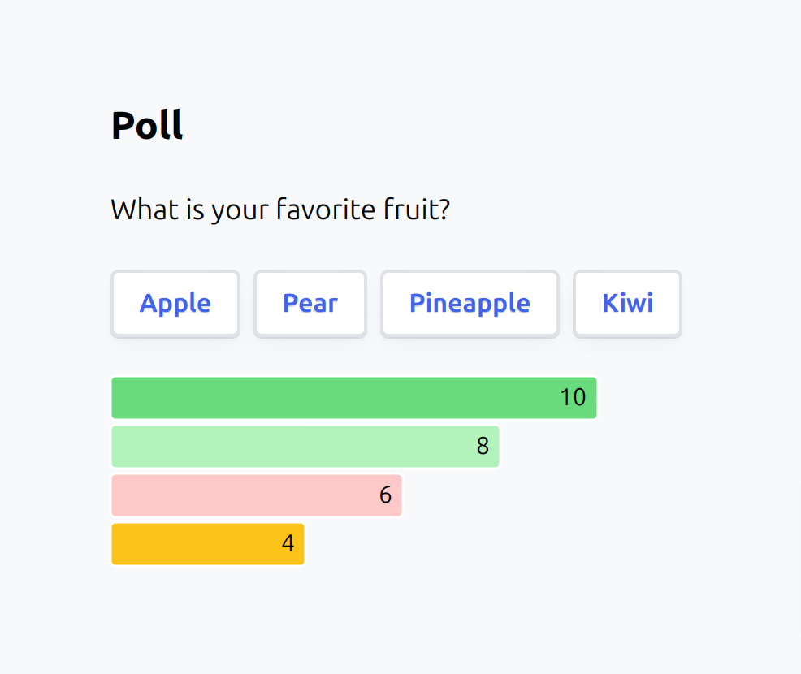

Realtime Poll with PartyServer + Svelte
------------

A multi-player poll that syncs using Cloudflare [Durable Objects](https://developers.cloudflare.com/durable-objects).

## Screenshot



## [Live Demo](https://ps-poll.joshnuss-test-hello.workers.dev)

## Usage

Install & run dev server:

```sh
pnpm install
pnpm dev
```

## License

MIT
